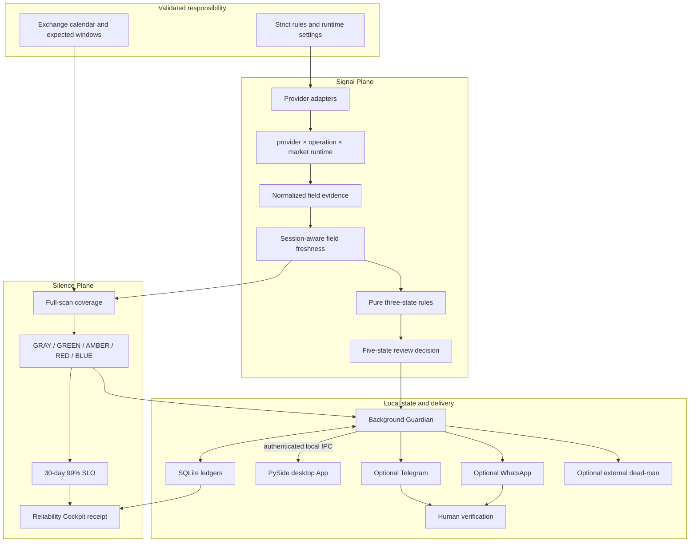

# Alpha Guard 目标架构：可信沉默（Trusted Silence）

状态：桌面 App / Guardian / SQLite 架构基线｜更新：2026-08-12

## 架构目标

Alpha Guard 优先保证证据可信与失败可见，而不是吞吐量或信号数量。任何一条方向性结论都必须能回答：评估了什么规则、实际值和阈值是什么、币种与单位是什么、event/source/observed 时间分别是什么、来自哪个 provider、为什么可用或被降级。

系统必须同时证明两件事：Signal Plane 的证据是否支持某条人工核验提醒，以及 Silence Plane 是否有资格声称“没有提醒”。缺失、过期、future-skew、来源失败、账本损坏或送达失败都不能被普通静默掩盖。

当前运行形态是单用户、本地优先：PySide 桌面 App 展示值班台，独立 Guardian 持有 APScheduler、外部网络和 SQLite 写入，Telegram 与 WhatsApp 提供独立移动提醒，Typer CLI 保留校验、诊断和显式修复入口。桌面与 Guardian 只通过同用户、带 token 的本地 socket 通信；当前没有浏览器 Web UI、远程控制面、订单服务或券商写入路径。

## 两平面运行链路



两个平面故意不互相伪造证据。保护账本损坏会让 Silence Plane fail closed 为 `RED`，但一条拥有独立新鲜字段的 Signal Plane 证据仍可被评估；系统同时明确禁止把局部信号解释为完整可信沉默。

## 核心契约

### 1. 配置与责任激活

规则、新闻和环境设置在任何真实工作前通过严格 Pydantic schema。未知字段、未知规则、非法市场、非有限阈值、错误币种和非法成本立即失败。仓库样例全部禁用，真实通知与 heartbeat 默认关闭。

启用 watchlist 会创建扫描责任，但配置本身不能制造 `GREEN`。新增市场、变更规则依赖或新鲜度策略会改变 protection contract；必须取得变更后的 full-scan 基线才能重新声称可信沉默。

### 2. Signal Plane

数据适配器只负责抓取和规范化，不参与投资判断。规则引擎是纯函数，单条规则返回 `TRIGGERED`、`NOT_TRIGGERED` 或 `UNKNOWN`；组合返回 `NONE`、`BUY_REVIEW`、`SELL_REVIEW`、`UNKNOWN` 或 `CONFLICT`。`REVIEW` 是内部兼容的人工核验类别，不是订单指令。

通知资格由稳定 signal key、规则契约版本、证据指纹、冷却时间和 SQLite claim lease 共同决定。只有发送成功才提交 notified 状态；发送失败释放 claim，过期 lease 可安全重试。动态文本统一转义，链接只接受 HTTP(S)。

### 3. 时间与字段级新鲜度

字段证据区分 provider event time、来源/session watermark 与本地 observed time。本地刚取得数据不能证明数据刚发生；observed-only 只有在字段策略明确允许时可用。价格按交易时段使用不同参考：开市时检查 wall-clock 年龄，休市时检查最近已完成 session watermark。时间超出 future-skew 容差则不可用。

这种设计采用 [Flink 的 event time / processing time 区分](https://nightlies.apache.org/flink/flink-docs-release-2.3/docs/concepts/time/)和 [dbt 的来源新鲜度阈值思想](https://docs.getdbt.com/reference/resource-properties/freshness)，但门禁粒度是规则真正依赖的 `price`、`pe_ttm`、`roe` 等字段。任一必需字段无法验证时返回 `UNKNOWN`，不会回填零或 false。

fresh cache 可以参与规则；provider 错误时，有界 stale-if-error 仅提供明确标记的诊断上下文，不可驱动方向性信号。它借鉴 [RFC 5861 §4](https://www.rfc-editor.org/rfc/rfc5861.html#section-4) 的“错误时有界使用 stale 内容”语义，同时保持市场决策 fail closed。

### 4. Provider Runtime

运行隔离键固定为 `provider × operation × market`。每个能力拥有独立 timeout、bulkhead、瞬态错误分类、幂等重试、Full Jitter backoff、受上限约束的 `Retry-After`、circuit breaker、缓存和样本窗口。

- timeout 返回截止时间内的确定结果；卡住的线程继续占用本能力的 bulkhead slot，防止无界后台调用；
- retry 只允许幂等、瞬态且 retry-safe 的操作；Full Jitter 参考 [AWS 指南](https://aws.amazon.com/blogs/architecture/exponential-backoff-and-jitter/)，`Retry-After` 遵循 [RFC 9110 §10.2.3](https://www.rfc-editor.org/rfc/rfc9110.html#section-10.2.3)；
- circuit 使用 `closed/open/half-open` 和有限恢复探测，对应 [Azure Circuit Breaker Pattern](https://learn.microsoft.com/en-us/azure/architecture/patterns/circuit-breaker)；
- provider 健康只统计真实调用，展示 sample count、成功率和 95% Wilson 下界；缓存命中不虚增成功率，样本不足显示 `insufficient_data`。

Runtime 状态写入 SQLite 前后都做结构、身份、时间和因果一致性校验。持久化内容损坏时拒绝覆盖，Silence Plane 转为 `RED`，只有显式 `repair-state --scope provider-runtime --confirm` 才能隔离。

### 5. Silence Plane 状态机

保护状态由可重放证据驱动：

| 状态 | 颜色 | 架构含义 |
|---|---|---|
| `UNCONFIGURED` / `PAUSED` | `GRAY` | 无责任或显式暂停；不计作健康 |
| `HEALTHY` | `GREEN` | 完整覆盖、当前责任可被信任 |
| `DEGRADED` | `AMBER` | 局部可用，整体沉默不可宣称可信 |
| `BLIND` | `RED` | 扫描、delivery 或 integrity 证据使完整静默不可信 |
| `RECOVERING` | `BLUE` | 已有第一条事故后 full scan，等待第二条 distinct 证据 |

状态改变生成持久化 edge event；重复 observation ID 幂等，不重复推进恢复计数。事故后第一次 distinct full scan 进入 `BLUE`，第二次才进入 `GREEN`。`BLUE` 只表示恢复/基线校准，不是通用维护模式。

### 6. SQLite、审计与修复

SQLite 保存 signal 状态、新闻指纹、运行记录、provider runtime、预期扫描窗口、保护状态/事件、integrity incident 和逐渠道 delivery 状态。数据库不保存 Telegram token、WhatsApp access token、新闻 API key 或 heartbeat URL。

`status --json` 从已验证账本构造纯、离线、脱敏的 Cockpit 收据。读取时若发现未来时间、身份不一致、语义篡改或损坏 JSON，必须返回 `RED` 证据，不能跳过坏行后继续显示 `GREEN`。

`repair-state` 只接受 `global`、`market:US`、`market:HK`、`provider-runtime` 或 `run-log`。它拒绝修复有效账本，要求 `--confirm`，在写入前使用 SQLite backup API 备份，并只输出 quarantine SHA-256。原始损坏载荷、URL、token 和异常正文不回显。

恢复证据按损坏类型区分：真实 `BLIND` 事故以及 global/market protection-state repair 从 `RED` 开始，必须经过两次 distinct full scan 才按 `RED → BLUE → GREEN` 恢复；合同代际变更或 `provider-runtime` / `run-log` quarantine 只使既有基线失效，状态为 `BLUE`，一次 post-epoch full scan 可以重建 `GREEN`。

### 7. 调度、SLO 与外部 watcher

交易所日历产生应运行窗口，APScheduler 负责触发。`coalesce`、`max_instances` 与 misfire grace 降低补跑风暴；执行、异常、missed 和 max-instances 事件仍必须写入运行证据，具体事件以 [APScheduler 3.x 文档](https://apscheduler.readthedocs.io/en/3.x/userguide.html#scheduler-events)和 [Events API](https://apscheduler.readthedocs.io/en/3.x/modules/events.html#event-codes)为准。

Silence Plane 计算 30 天 99% full-scan SLO：

```text
error_rate = (bad + missing + pending) / expected
burn_rate = error_rate / 0.01
```

告警聚焦可行动状态边沿、恢复边沿和错误预算，而不是为每个内部异常刷屏。设计依据见 [Google SRE SLO alerting](https://sre.google/workbook/alerting-on-slos/)与 [Prometheus alerting practices](https://prometheus.io/docs/practices/alerting/)。

外部 dead-man heartbeat 补足“进程彻底停止后无法自报”的黑盒盲点。`HEARTBEAT_ENABLED`、`HEARTBEAT_URL`、`HEARTBEAT_TIMEOUT_SECONDS` 显式配置；URL 是 bearer secret，不进入数据库、日志或 Cockpit。Healthchecks 的 [Pinging API](https://healthchecks.io/docs/http_api/)提供作业 start/success/failure 语义，其 [Slug URL 文档](https://healthchecks.io/docs/slug_urls/)明确 UUID / ping key 的秘密属性。

### 8. Cockpit 收据

当前 `status --json` 把领域事实分为四个稳定视角：

- `schedule`：expected / deadline / 30 天 SLO；
- `silence`：颜色、责任、覆盖、新鲜数据和 trusted decision；
- `providers`：能力、circuit、缓存和 Wilson 样本；
- `delivery`：Telegram、WhatsApp 与 external watcher 的 PREVIEW/ACTIVE 状态和脱敏结果；WhatsApp accepted 不冒充 webhook delivered。

这些字段回答“该跑的跑了吗、沉默可信吗、哪个依赖退化、送达是否可用”。未来 Web Cockpit 只渲染这份收据。当前没有 OpenTelemetry exporter；若未来需要，应按 [OpenTelemetry HTTP metrics conventions](https://opentelemetry.io/docs/specs/semconv/http/http-metrics/)映射低基数指标并锁定规范版本。

## 安全、许可与部署边界

密钥只从环境或本机 credential store 读取，外部错误分类为低基数 code。heartbeat URL、IPC token、WhatsApp/Telegram 凭据与 API key 不得出现在 URL 日志、SQLite、JSON 收据、截图、LaunchAgent、Windows Run value 或 issue。桌面从不直接读取 SQLite 或业务 secret；本地 IPC 不监听 TCP，使用 per-user socket、方法 allowlist、帧上限、请求 ID 和 token 鉴权。公开标题、摘要和 provider 错误均是不可信外部文本，必须限长、校验和转义。

yfinance、AKShare、Finnhub、NewsAPI 和模型服务各有个人使用、开发环境、内容再分发或商业使用限制。默认架构只面向个人本地自托管；公开服务、团队生产部署、商业展示或 SaaS 化必须先完成数据授权、隐私和法律评估。

## 演进边界

短期继续稳定“桌面 App + 单实例 Guardian + SQLite + Telegram/WhatsApp + heartbeat”，不为了“像大型系统”提前引入微服务、消息队列或 PostgreSQL。未来可选的只读 Web、更多通知渠道和授权 provider 必须建立在相同契约上；任何界面都不能增加交易动作或弱化 fail-closed 语义。安装、自启与 IPC 细节见[桌面指南](DESKTOP.md)。
