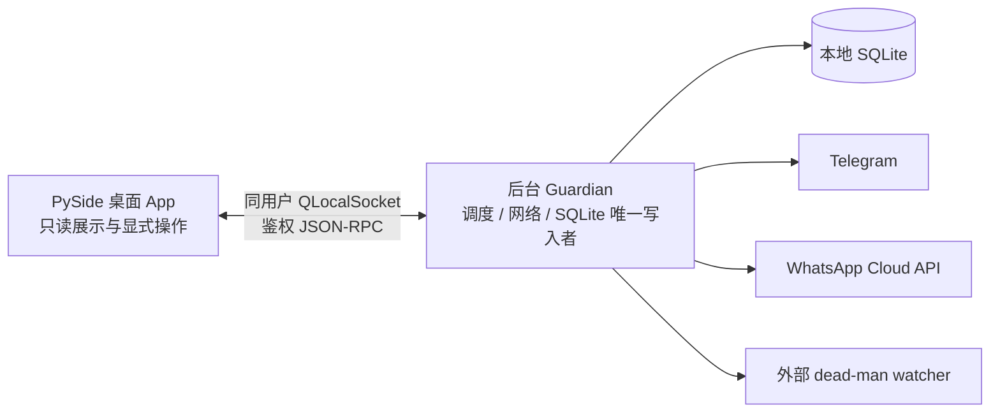

# 桌面 App、后台 Guardian 与移动提醒

状态：本地桌面交付基线｜更新：2026-08-20

Alpha Guard 的桌面形态不是“把 CLI 套进一个窗口”，而是三个职责明确的部件：



桌面 App 关闭后 Guardian 继续运行；Guardian 退出也不会让桌面越权接管数据库或密钥。桌面只显示 Guardian 返回的脱敏 DTO，无法直接打开 SQLite、调用通知 SDK 或访问 provider secret。

## 安装与启动

支持 Python 3.11 和 3.12。源码工作区中安装桌面、Guardian 和 Telegram 依赖：

```bash
uv sync --frozen --extra desktop --extra notifications --extra futu
```

从构建好的 wheel 安装时使用相同 extras：

```bash
uv build --wheel
python -m pip install "alpha-guard[desktop,notifications,futu]"
```

项目尚未发布到包索引时，把 `alpha-guard[...]` 换成实际 wheel 路径即可。三个入口彼此独立：

```bash
# 桌面值班台；Guardian 不可用时会做有界重连并尝试启动它
uv run alpha-guard-desktop

# 前台运行 Guardian，便于系统服务管理与排障
uv run alpha-guard-guardian

# 原有 CLI 仍可用于校验、诊断和显式修复
uv run alpha-guard status --json

# 离线 UI 演示，不启动 Guardian、不联网、不读取真实状态
uv run alpha-guard-desktop --demo
```

生产默认不是 demo。桌面启动时从系统 credential store 取得本机 IPC token，连接不到同用户 Guardian 时调用已安装的 `alpha-guard-guardian`；重连次数和等待时间有上限，不会冻结 GUI。测试截图或 CI 应设置 `QT_QPA_PLATFORM=offscreen`。

## 原生下载包

仓库的 `Desktop release artifacts` GitHub Actions workflow 可由 `v*` tag 或手动 `workflow_dispatch` 触发。它使用 Python 3.12 与固定版本 PyInstaller，在原生 runner 上构建两个 onedir launcher，并把它们装入同一个 `AlphaGuard` 目录：

- `alpha-guard-macos-arm64.tar.gz`：在 `macos-15` Apple Silicon runner 上构建，包含 `AlphaGuard-Desktop.app` 与 `alpha-guard-guardian/`；
- `alpha-guard-windows-x64.zip`：在 `windows-2025` x64 runner 上构建，包含 `AlphaGuard-Desktop/` 与 `alpha-guard-guardian/`。

PyInstaller 位于独立的 `desktop-build` extra 并由 `uv.lock` 固定；普通用户安装 `desktop` 时不会带入发布构建器。本地若只需检查构建环境，可以执行 `uv sync --frozen --extra desktop --extra desktop-build`，但正式产物应由对应原生 GitHub runner 构建。

workflow 会硬校验 `platform.machine()`，避免 runner 标签变化后把错误架构装进正确文件名。GitHub 当前把 `macos-15` 列为 arm64、`windows-2025` 列为 x64，见[官方 hosted runner 表](https://docs.github.com/en/actions/reference/runners/github-hosted-runners)。PyInstaller 的 onedir 模式把解释器和依赖放入可分发目录，目标机器无需另装 Python；构建选择 onedir 是为了让首个原生版本更容易检查和排障，依据见[PyInstaller 官方 operating mode](https://www.pyinstaller.org/en/stable/operating-mode.html)。

每个 archive 内有 `BUILD-INFO.txt`，记录 commit、ref、架构、Python、PyInstaller 版本和签名状态。workflow 对两个冻结后的 launcher 运行 `--help`，并对 Guardian 运行 `--version`；macOS 还执行严格 `codesign --verify`。这只是启动 smoke，不会连接真实 provider 或发送移动消息。

下载并解压后，Guardian 的可编辑运行配置位于 `AlphaGuard/alpha-guard-guardian/`：

```text
AlphaGuard/
├── AlphaGuard-Desktop.app/        # macOS；Windows 为 AlphaGuard-Desktop/
├── alpha-guard-guardian/
│   ├── alpha-guard-guardian       # Windows 后缀为 .exe
│   ├── .env.example               # 复制为 .env，再填写本机 secret
│   ├── signals/rules.yaml
│   └── news/config.yaml
├── BUILD-INFO.txt
├── DESKTOP.md
└── README.md
```

桌面 release launcher 会把同一 `AlphaGuard` 目录中的 Guardian 加到它自己的子进程搜索路径，因此双击桌面后仍能按生产默认启动/连接后台进程；它不会把这个路径永久写入用户的全局 `PATH`。

不要只把 `.app` 单独拖走：`AlphaGuard-Desktop.app` 与
`alpha-guard-guardian/` 必须保留在同一个 `AlphaGuard` 文件夹中。后台程序、
可编辑规则和 `.env` 都在 Guardian 文件夹；只移动窗口外壳会导致后台无法启动。

### 正式签名与 notarization

没有仓库 secrets 时，workflow 仍会产出 30 天可下载的测试 artifact：Windows 未签名；Apple Silicon 包只有 PyInstaller/平台要求的 ad-hoc 签名，没有 Developer ID，也没有 notarization。此类包会触发系统来源警告，不应对外宣称正式发行版。

macOS 正式链路需要全部或分阶段配置：

- `MACOS_CERTIFICATE_P12_BASE64`
- `MACOS_CERTIFICATE_PASSWORD`
- `MACOS_SIGNING_IDENTITY`
- `APPLE_ID`
- `APPLE_TEAM_ID`
- `APPLE_APP_PASSWORD`

前三项存在时，PyInstaller 用 Developer ID 对收集的二进制和 App 签名，并启用 hardened runtime；后三项同时存在时，workflow 再用 `notarytool` 等待 Apple notarization，并 staple 桌面 `.app`。若只有签名 secret，没有 notarization secret，`BUILD-INFO.txt` 会明确标成 signed but not notarized test artifact。

Windows Authenticode 可选 secrets：

- `WINDOWS_CERTIFICATE_PFX_BASE64`
- `WINDOWS_CERTIFICATE_PASSWORD`

两项都存在时，workflow 用 runner 自带的 x64 `signtool.exe` 对 Desktop 与 Guardian launcher 做 SHA-256 签名和可信时间戳。任何 secret 缺失都不会降级成“看似已签名”；artifact 内的 build info 会如实标记状态。证书只写入 runner 的临时目录并在步骤结束前删除，Actions artifact 不包含证书、密码或原始 secret。

## 登录自启与进程生命周期

设置页的“登录时启动 Guardian”只注册当前用户，不需要管理员权限，也不会把 `.env` 内容复制到系统启动项。

### macOS

- 使用 per-user LaunchAgent，默认标签为 `com.alpha-guard.guardian`；
- plist 位于 `~/Library/LaunchAgents/com.alpha-guard.guardian.plist`；
- `RunAtLoad=true`，Guardian 在前台运行，由 `launchd` 观察；
- 非成功退出会按节流窗口重启，正常 `guardian.stop` 后保持停止；
- plist 只包含绝对可执行文件路径与固定参数，不包含 token、API key 或 heartbeat URL。

### Windows

- 使用当前用户 `HKCU\Software\Microsoft\Windows\CurrentVersion\Run`；
- value 名包含 application/profile 的稳定摘要，避免不同 profile 冲突；
- 命令使用绝对路径和 Windows 标准引号规则；
- 注册表值不包含 secret；Windows Run 负责登录启动，不提供崩溃重启监督。

禁用登录自启只移除 Alpha Guard 自己的 LaunchAgent 或 HKCU value，不删除 SQLite、规则、日志或 credential store 中的 token。桌面窗口的关闭操作只断开 IPC；要明确停掉后台进程，应使用桌面中的 Guardian 停止操作或结束对应系统用户服务。

## 本机安全边界

1. Guardian 是 SQLite、调度器和外部网络的唯一所有者。桌面 App 不导入状态存储层，也不保存通知密钥。
2. IPC 使用 `QLocalServer` / `QLocalSocket`，不监听 localhost TCP，更不暴露局域网端口。
3. socket 名按 application、profile 和本地用户生成不透明摘要，并限制为当前用户访问。
4. 每个 JSON-RPC 请求都带独立本机 token。token 优先存入系统 keyring；keyring 不可用时才写入权限为 `0600`、父目录为 `0700` 的用户配置文件。token 不进入 DTO、日志或截图。
5. 协议采用 4 字节长度前缀、严格 JSON、1 MiB 上限、方法 allowlist、请求 ID 校验和有界超时。未知方法、过大帧与响应 ID 不匹配都会 fail closed。
6. UI 只发送公开偏好，例如时区、语言、安静时段和登录自启。Telegram token、WhatsApp access token、provider key 与 heartbeat URL 继续只从本地环境或受信任 secret 配置读取。

这一边界不等于“同一账号下的任意恶意进程都不可信”。若本机用户会话已被完全攻陷，攻击者通常也能以该用户权限读取配置或操纵进程；此时应先隔离主机并轮换 Telegram、Meta、provider 与 heartbeat 凭据。

## Futu OpenD 只读行情

原生 Guardian 已包含 Futu Python SDK，但不包含 OpenD，也不会读取 Futu
账号密码。首次启用仍需完成下面几步：

1. 从 Futu 官方安装并登录 OpenD，完成 OpenAPI 协议/问卷；保持 OpenD
   监听 `127.0.0.1:11111`。不要监听局域网地址。
2. 在 `AlphaGuard/alpha-guard-guardian/` 中把 `.env.example` 复制为
   `.env`，把 `FUTU_ENABLED=false` 改成 `FUTU_ENABLED=true`。
3. 在同一目录的 `signals/rules.yaml` 中，把需要监控的 AAPL、腾讯或自定义
   标的设为 `enabled: true`，并先人工复核阈值与币种。
4. 保持 OpenD 和 Guardian 运行，在桌面点击“运行一次扫描”。扫描完成后，
   Providers 页出现 `futu / us_snapshot` 或 `futu / hk_snapshot`，且对应价格
   字段来源为 `futu`，才证明这次实际采用了 Futu 行情。

Guardian 每个市场每轮最多按 400 个代码批量读取快照；它不是逐笔行情终端。
OpenD 未启动、未登录、超时、无行情权限或返回时间不可用时，Futu 会在有界
时间内失败并回退到港股 AKShare / yfinance。回退保证扫描尽量继续，但不能
证明 Futu 已连接。`doctor` 默认完全离线，因此也不会主动探测 11111 端口。

Alpha Guard 只创建 `OpenQuoteContext`。它不创建交易 Context、不解锁账户、
不接收交易密码，也没有外部下单调用。Futu 官方接入说明见
[OpenD 快速开始](https://openapi.futunn.com/futu-api-doc/en/quick/demo.html)与
[市场快照接口](https://openapi.futunn.com/futu-api-doc/en/quote/get-market-snapshot.html)。

## Telegram 与 WhatsApp 独立送达

Telegram 和 WhatsApp 是两个独立 channel，不是主备链路。每个业务事件都按 `business key × channel × config generation` 原子领取 claim：

- Telegram 已发送、WhatsApp 失败时，下一轮只重试 WhatsApp；
- WhatsApp 已接受、Telegram 失败时，下一轮只重试 Telegram；
- 任一渠道的 token、recipient 或模板配置变化都会形成新的配置代际；
- Telegram / WhatsApp 的 Trust Receipt 最长只证明 24 小时；Guardian 按 UTC 日重新证明，过期前不会继续给外部 heartbeat 放行；
- 设置页的“发送测试回执”先返回 `queued`，最终 accepted/failed 结果以随后刷新的通道状态为准，不把排队成功冒充提供者接收；
- SQLite 只记录渠道、代际、时间、accepted/sent 状态和低基数错误码，不记录 token、完整响应或消息正文。

Telegram 的 `sendMessage` 成功表示 Bot API 接受了请求。WhatsApp 的状态更需要严格区分。

### WhatsApp 模板和 24 小时窗口

启用 WhatsApp 前，必须在 Meta WhatsApp Manager 中创建并获批 signal、incident 和 trust 模板；news 模板可选：

```dotenv
WHATSAPP_ENABLED=true
WHATSAPP_ACCESS_TOKEN=...
WHATSAPP_PHONE_NUMBER_ID=...
WHATSAPP_DEFAULT_TO=8613800000000
WHATSAPP_GRAPH_API_VERSION=v26.0
WHATSAPP_TIMEOUT_SECONDS=10
WHATSAPP_TEMPLATE_LANGUAGE_CODE=zh_CN
WHATSAPP_SIGNAL_TEMPLATE_NAME=alpha_guard_signal
WHATSAPP_INCIDENT_TEMPLATE_NAME=alpha_guard_incident
WHATSAPP_NEWS_TEMPLATE_NAME=alpha_guard_news
WHATSAPP_TRUST_TEMPLATE_NAME=alpha_guard_trust
```

模板名必须与已批准名称、语言和参数顺序完全一致。收件人必须已经合法 opt in，并使用 E.164 号码。Alpha Guard 不代替用户完成 Meta Business 验证、模板审批、收件人 consent 或费用管理。

Meta 的 customer service window 从用户最后一条消息起持续 24 小时：窗口外只能主动发送已批准模板；自由文本只允许在调用方逐次明确确认窗口仍开放时发送。Guardian 的信号、事故和 trust receipt 使用模板，不通过“猜测窗口还开着”绕过限制。参考 Meta 的[模板概览](https://developers.facebook.com/documentation/business-messaging/whatsapp/templates/overview)和[customer service window](https://developers.facebook.com/documentation/business-messaging/whatsapp/messages/send-messages#customer-service-windows)。

### accepted 不等于 delivered

Cloud API 的 `2xx` 和 `wamid` 只证明 Meta 接受请求。手机侧的 `sent`、`delivered`、`read` 或 `failed` 是后续 webhook 状态；没有 webhook 证据时，桌面和 Cockpit 不得把 accepted 写成 delivered。

当前仓库包含发送端和 accepted 账本，不托管公网 webhook。若部署方需要端到端 delivered/read 证明，必须另行提供 HTTPS webhook，完成 Meta challenge、验证签名、限制请求体、按 `wamid` 幂等关联，并只把验证后的低基数状态交给 Guardian；不要把 webhook secret、原始手机号或完整 payload 写进普通日志。状态字段见 Meta 的[消息状态 webhook 文档](https://developers.facebook.com/documentation/business-messaging/whatsapp/webhooks/reference/messages/status)。

## 排障顺序

1. 运行 `uv run alpha-guard validate` 与 `uv run alpha-guard doctor`，确认配置可解析。
2. 运行 `uv run alpha-guard-guardian` 观察前台启动是否成功；已运行的同 profile Guardian 会保持单实例。
3. 打开 `uv run alpha-guard-desktop`，查看顶部 Guardian 连接状态；不要用 `--demo` 判断真实链路。
4. 用 `uv run alpha-guard status --json` 对照桌面收据，确认问题位于 schedule、silence、provider 还是 delivery。
5. Telegram/WhatsApp 测试只证明对应 API 的提交结果。WhatsApp delivered/read 必须再查已验证 webhook 状态。
6. 只有确定 SQLite 账本损坏时才按[可靠性 Runbook](RELIABILITY.md)备份并执行最小 scope repair；重装桌面依赖不会修复运行证据。

## 永久边界

桌面 App、Guardian 与移动提醒都只服务于人工复核。它们不接收券商凭据，不产生订单，不点击券商界面，不把 `GREEN` 解释为资产安全，也不把 `BUY_REVIEW` / `SELL_REVIEW` 解释为交易指令。
