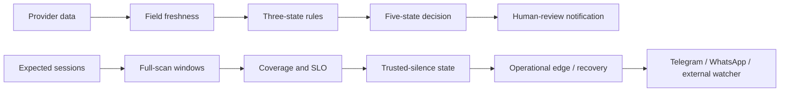

# 可信沉默（Trusted Silence）可靠性契约

状态：Foundation 运行契约｜更新：2026-08-10

Alpha Guard 的产品承诺不是“没有提醒”，而是“能够证明为什么没有提醒”。只有当预期扫描按时完成、启用范围被完整覆盖、规则所需字段足够新鲜、运行账本可信，并且启用的送达链路可用时，沉默才可以被标为可信。

本项目是港美股自托管、默认只读的决策支持工具。可选的 Futu OpenAPI 集成默认关闭，启用后交易默认 dry-run；不承诺收益；规则结果、新闻标注和可靠性状态都不构成投资建议。

## 当前形态与未来边界

当前交付形态是 PySide 桌面 App、独立 Guardian、CLI、APScheduler、SQLite、可选 Telegram / WhatsApp，以及可选外部 dead-man heartbeat。桌面展示 Guardian 的脱敏 Reliability Cockpit 收据；`uv run alpha-guard status --json` 保留为排障和自动化入口。

移动通道的 Trust Receipt 是有时效的：单次成功最多证明 24 小时，配置代际变化会立即清除旧证明。Guardian 必须重新完成当前 Telegram / WhatsApp 通道的真实 accepted 尝试，才允许继续发送外部 heartbeat。

仓库目前没有浏览器 Web UI、远程控制面或交易面。未来 Web 若消费同一份收据，不得绕过领域契约，也不能把 `AMBER`、`RED` 或 `UNKNOWN` 美化成确定结论。

## 两个平面



### Signal Plane

Signal Plane 回答“现有证据是否满足用户预先写下的规则”。单条规则只有 `TRIGGERED`、`NOT_TRIGGERED`、`UNKNOWN`；标的级决策只有 `NONE`、`BUY_REVIEW`、`SELL_REVIEW`、`UNKNOWN`、`CONFLICT`。它只消费通过字段级新鲜度门禁的证据，动态提醒始终要求人工核验。

### Silence Plane

Silence Plane 回答“系统是否有资格声称没有需要提醒的事项”。它观察预期运行、完整覆盖、provider 能力、送达、状态完整性和 30 天 SLO。Signal Plane 某条独立且新鲜的证据仍可能可用，并不代表整个 Silence Plane 健康；反过来，`GREEN` 也只证明扫描责任被可靠履行，不证明市场安全或未来不会亏损。

这一区分遵循 [Google SRE 对白盒与黑盒监控的划分](https://sre.google/sre-book/monitoring-distributed-systems/)：业务判断与“监控本身是否还活着”必须各自有证据。

## 保护状态与颜色

颜色是 Silence Plane 的保护状态，不是规则方向、市场涨跌或投资评级。

| 颜色 | 状态 | 精确定义 | 可否宣称可信沉默 |
|---|---|---|---:|
| `GRAY` | `UNCONFIGURED` / `PAUSED` | 没有启用责任，或用户显式暂停；它不等同普通未知，也不是事故 | 否 |
| `GREEN` | `HEALTHY` | 当前责任范围有完整、及时且一致的 full-scan 证据 | 是 |
| `AMBER` | `DEGRADED` | 局部能力或覆盖缺失；其余具备独立新鲜证据的方向性提醒可以继续 | 否 |
| `RED` | `BLIND` | 完整静默不可相信，或关键 delivery / integrity 失败 | 否 |
| `BLUE` | `RECOVERING` | 事故后的恢复或新基线校准中，已有第一份新鲜 full-scan 证据 | 否 |

`BLUE` 不是通用维护色。一次事故后，第一条符合条件的完整扫描把状态推进到 `BLUE`；只有第二条具有不同 observation ID 的完整扫描才能恢复 `GREEN`。重复投递、同一 ID 的重放或非完整扫描不计数。任何中途失败都会打断恢复证据链。

状态通知只发生在需要关注的边沿以及最终恢复边沿，不会在每次调度中重复发送同一事故。该策略与 [Prometheus 的告警实践](https://prometheus.io/docs/practices/alerting/)一致：告警应少、可行动并聚焦用户可见症状；运行时仍把事故状态持久化，不能把“没有重复通知”误读成“事故已经消失”。

## 字段级数据新鲜度

### 三种时间语义

每条字段证据必须区分三种时间语义：

- event：市场事件或数值实际对应的时间；在当前规范化模型中，有明确 provider 事件时间时记录为 `source_as_of`；
- source：来源声称已经覆盖到的时间边界，例如最近一个已完成交易时段的 watermark；
- observed：本进程实际取得数据的时间 `observed_at`。

`observed_at` 只能证明“刚刚拿到”，不能证明内容刚刚发生。来源没有事件时间时，必须明确标为 observed-only；只有字段策略显式允许时才可使用。这个做法借鉴了 [Apache Flink 对 event time 与 processing time 的区分](https://nightlies.apache.org/flink/flink-docs-release-2.3/docs/concepts/time/)；可接受来源延迟则采用与 [dbt freshness](https://docs.getdbt.com/reference/resource-properties/freshness) 类似的按来源时间戳和阈值判断，但 Alpha Guard 的预算落实到每个规则依赖字段。

### Session-aware 与 future skew

价格字段在开市阶段按 wall-clock 最大年龄判断；休市、周末和节假日则与交易所日历给出的最近已完成 session watermark 比较，避免把合法的前收盘数据仅因经过周末就判为过期。基本面字段可以使用不同、更长的预算，不能套用价格预算。

所有时间必须带时区并归一到 UTC。若 event/source/observed 时间超出允许的 future-skew 容差，证据标为 `FUTURE` 且不可用于信号；系统不会用本机时间去“修正”可疑来源时间。

### Field-level stale-if-error

缓存按 `provider × operation × market` 与请求身份隔离。新鲜缓存可以正常参与评估；上游失败时，只能在配置的有限窗口内返回 stale-if-error 上下文，并明确标记 `cache_state=stale_if_error`。它可帮助人理解最近一次已知值，但当前规则门禁将其设为不可用于方向性信号。

这里采用的是 [RFC 5861 `stale-if-error`](https://www.rfc-editor.org/rfc/rfc5861.html#section-4) 的有界降级思想，不声称市场数据缓存本身是 HTTP 缓存实现。字段缺失、时间无效、来源过期、future skew、语义不明或 stale-if-error 都 fail closed 为 `UNKNOWN`，绝不填零，也绝不把未知当作 `NOT_TRIGGERED`。

## Provider 运行隔离

每个外部能力的稳定身份是 `provider × operation × market`，例如“某提供者的 US quote 操作”。超时、并发、重试、熔断、缓存和健康样本都以这个低基数身份隔离；ticker、URL、异常文本和 secret 不进入能力标签。

| 机制 | 运行契约 |
|---|---|
| Timeout | 每次调用有硬截止时间；超时的第三方线程继续占用自己的 bulkhead slot，直到真正退出，避免无限堆积 |
| Bulkhead | 每个能力使用有界并发；无空位时快速失败，不拖垮其他 provider 或市场 |
| Retry | 只重试明确可重试的瞬态错误和幂等操作；永久错误、不可安全重试的超时立即停止 |
| Backoff | 指数上限内使用 Full Jitter，分散同时恢复造成的请求洪峰 |
| `Retry-After` | 接受 delta-seconds 或 HTTP-date，并在本地上限内尊重服务端等待时间 |
| Circuit | `closed → open → half-open`；连续失败后快速拒绝，只允许有限恢复探测 |
| Cache | fresh hit 不制造网络成功样本；stale-if-error 有界、可辨识且不可用于方向性信号 |

Full Jitter 的具体选择来自 [AWS 对 Exponential Backoff and Jitter 的比较](https://aws.amazon.com/blogs/architecture/exponential-backoff-and-jitter/)，timeout、有限重试和 jitter 的整体原则见 [AWS Builders’ Library](https://aws.amazon.com/builders-library/timeouts-retries-and-backoff-with-jitter/)。`Retry-After` 解析遵循 [RFC 9110 §10.2.3](https://www.rfc-editor.org/rfc/rfc9110.html#section-10.2.3)。熔断状态与有限 half-open 探测对应 [Azure Circuit Breaker Pattern](https://learn.microsoft.com/en-us/azure/architecture/patterns/circuit-breaker)。

### 健康统计、Wilson 与样本数

provider 健康度只统计真实网络尝试，不让 fresh cache hit 虚增成功率。Cockpit 同时展示 `sample_count`、原始成功率、95% Wilson 下界与等级；样本未达到最小数量时必须显示 `insufficient_data`，不能用一次成功宣称稳定。默认评分使用 `z=1.96`，达到样本门槛后才按 Wilson 下界划分 healthy / degraded / unreliable。

当前实现把这些低基数事实写入 SQLite 和 Cockpit JSON，并没有宣称已部署 OpenTelemetry exporter。未来 exporter 应复用 [OpenTelemetry HTTP metrics semantic conventions](https://opentelemetry.io/docs/specs/semconv/http/http-metrics/) 的请求时长、错误类型等语义；该规范是滚动版本，接入时必须锁定版本并继续禁止 URL、ticker 和 secret 形成高基数属性。

## 调度、Cockpit 与 30 天 SLO

APScheduler 决定任务何时触发，交易所日历决定某个市场时点是否应执行。`coalesce`、`max_instances` 与 misfire grace 只降低重复和积压风险，不能单独证明任务成功；应把 `EVENT_JOB_EXECUTED`、`EVENT_JOB_ERROR`、`EVENT_JOB_MISSED`、`EVENT_JOB_MAX_INSTANCES` 等事件落实为运行证据。行为依据固定在 [APScheduler 3.x User Guide](https://apscheduler.readthedocs.io/en/3.x/userguide.html#scheduler-events)与 [3.x Events API](https://apscheduler.readthedocs.io/en/3.x/modules/events.html#event-codes)。

### Cockpit 四问

运行：

```bash
uv run alpha-guard status --json
```

当前 CLI 收据应直接回答四个问题：

1. 该跑的 full scan 跑了吗？查看 `schedule.markets` 的 expected、deadline 和完成状态。
2. 当前沉默可信吗？查看 `silence` 的状态、颜色、完整覆盖、新鲜数据和 trusted-decision 比例。
3. 哪个外部能力正在退化？查看 `providers.capabilities` 的 `provider × operation × market`、circuit、样本数与 Wilson 下界。
4. 提醒与外部 watcher 可用吗？查看 `delivery.telegram`、`delivery.whatsapp` 和 `delivery.external_watcher` 的模式、配置、最近尝试、成功时间和低基数错误码。WhatsApp API accepted 不能写成 webhook delivered。

桌面 Cockpit 只负责把这四问可视化，不能自行重新计算或覆盖 SQLite 账本；未来 Web 同样受此约束。

### 30 天 SLO

Silence Plane 的 SLO 是“过去 30 天内，启用责任对应的预期 full-scan 窗口有 99% 形成合格证据”。它不是收益率、行情准确率、规则命中率或 Telegram/WhatsApp 到达人类设备的保证。

```text
violations = bad + missing + pending
error_rate = violations / expected
error_budget = 1 - 0.99 = 0.01
burn_rate = error_rate / 0.01
```

没有合格预期窗口时，比例和 burn rate 应为 `null`，而不是伪造 0% 错误或 `GREEN`。`burn_rate=1` 表示正以刚好耗尽 30 天错误预算的速度运行；大于 1 表示超预算。Cockpit 同时保留计数，避免小样本百分比误导。

这一定义贴近 [Google SRE Workbook 的 SLO 与 burn-rate 告警](https://sre.google/workbook/alerting-on-slos/)；批任务还应记录最近成功、耗时与完成状态，参考 [Prometheus instrumentation practices](https://prometheus.io/docs/practices/instrumentation/)。告警以边沿、错误预算和可行动症状为主，不为每个内部异常分别刷屏。

## 外部 dead-man heartbeat

内部进程无法可靠报告“自己已经彻底停止”。可选外部 watcher 通过缺失 heartbeat 检测调度器、主机或整个进程失联，补足 Silence Plane 的黑盒视角。可使用托管服务或自托管的 [Healthchecks 开源实现](https://github.com/healthchecks/healthchecks)；其 [Pinging API](https://healthchecks.io/docs/http_api/)支持 start、success 和 failure 语义。

配置采用三个显式环境变量，默认关闭：

```dotenv
HEARTBEAT_ENABLED=false
HEARTBEAT_URL=<secret-ping-url>
HEARTBEAT_TIMEOUT_SECONDS=5
```

完整 URL 是 bearer secret。Healthchecks 官方明确说明 UUID 或项目 ping key 具有认证能力，见 [Slug URLs 安全说明](https://healthchecks.io/docs/slug_urls/)；因此 `HEARTBEAT_URL` 不得进入 Git、命令行参数、异常文本、SQLite、`status --json` 或截图。状态收据只暴露是否已配置、低基数错误码和时间，不回显 URL。URL 泄漏后应立即在外部服务轮换。

heartbeat 成功不能替代 full scan：只有扫描覆盖、数据新鲜度和账本完整性都成立时，Silence Plane 才能推进健康证据。相同事故只通知首次状态边沿；恢复通知只在满足恢复条件后发送。外部 watcher 自身在 ACTIVE 模式不可用时，整体状态 fail closed 为 `RED`。

## 事故 Runbook

### 先诊断，后修复

1. 停止长期 `run` 进程，避免排障时继续产生新状态。
2. 保存脱敏 Cockpit 收据：`uv run alpha-guard status --json > reliability-status.json`。
3. 记录颜色、reason codes、受影响市场、预期窗口、provider 能力和 delivery 状态；不要复制 provider 原始异常或 heartbeat URL。
4. 先修复网络、上游、密钥权限、系统时钟或配置。只有 SQLite 证据确实损坏时才使用 `repair-state`。

`repair-state` 是最后手段，不是清空告警的按钮。命令拒绝修复健康账本，并要求显式 `--confirm`：

```bash
uv run alpha-guard repair-state --scope global --confirm
uv run alpha-guard repair-state --scope market:US --confirm
uv run alpha-guard repair-state --scope market:HK --confirm
uv run alpha-guard repair-state --scope provider-runtime --confirm
uv run alpha-guard repair-state --scope run-log --confirm
```

优先选择最小 scope；`global` 只用于全局保护账本损坏。命令在任何隔离或修复前使用 SQLite backup API 创建带时间戳的本地备份；备份仍可能包含个人规则和运行证据，不应公开上传。损坏载荷进入 quarantine，终端只输出备份路径与 SHA-256 摘要，不回显原始 JSON、URL、token 或异常正文。

修复不会凭空恢复信任。真实 `BLIND` 事故以及 global/market protection-state repair 从 `RED` 开始，需要两次具有不同 observation ID 的新鲜 full scan，按 `RED → BLUE → GREEN` 恢复。合同代际变更或 `provider-runtime` / `run-log` quarantine 属于基线失效：保留为 `BLUE/RECOVERING`，一次 post-epoch full scan 可以重建 `GREEN`。零启用责任则诚实回到 `GRAY/UNCONFIGURED`。修复后再次运行 `status --json`，以其中的颜色、reason codes、SLO、provider 和 delivery 证据为准。

## 八步用户旅程

1. 安装基础依赖：`uv sync --frozen`；此时所有标的、新闻、AI、通知和 heartbeat 默认关闭。
2. 运行 `uv run alpha-guard validate`，先让严格配置校验通过。
3. 运行 `uv run alpha-guard doctor`，确认本地依赖、SQLite 和调度计划；默认不联网。
4. 运行 `uv run alpha-guard dry-run`，用合成数据理解三态规则、五态决策和证据包；不联网、不通知、不写状态。
5. 只启用一个已核验标的，先运行不带 `--notify` 的 `scan`，检查 event/source/observed 时间、币种、阈值和质量问题。
6. 运行 `uv run alpha-guard status --json`，用 Cockpit 四问确认责任范围和初始 full-scan 基线。
7. 按需安装 desktop/notification extra，安全配置 Telegram、WhatsApp 与外部 heartbeat；分别验证渠道后才允许 Guardian 连续真实提醒。
8. 收到 `AMBER`、`RED` 或恢复边沿时，按 Runbook 先保留证据、定位原因；只在确认账本损坏时执行最小 scope 的 `repair-state`，再按事故类型完成两次 distinct full scan 或一次 post-epoch full scan。

## 不可跨越的边界

- 只读决策支持，不接收交易权限，不调用订单接口，不执行任何交易。
- `BUY_REVIEW` / `SELL_REVIEW` 只是人工核验类别，不是买卖指令。
- `GREEN` 只代表系统履行了扫描责任，不代表资产值得买入、持有或卖出。
- 市场数据、新闻、AI 和免费 provider 可能延迟、不完整或受许可限制；用户必须独立核验并遵守上游条款。
- 所有输出均不构成投资建议；使用者自行承担决策责任。
